# RCDL — Rockchip RKNPU 视觉开发框架

[](LICENSE)
[](CMakeLists.txt)
[](pyproject.toml)
[-0A7BBB.svg)](#运行环境要求)
[](docs/ROADMAP.md)

[English](README.en.md) | **简体中文**

> ### 几分钟做出一个 RKNPU 视觉应用。
> 统一的 C++ / Python API，覆盖取流 → VPU 硬件编解码 → RGA 硬件预处理 → NPU 推理 → 后处理整条链路。
> **构建在 Rockchip 官方运行时（RKNPU2 / RGA / MPP）之上，不是取代它。**

RCDL 是 [BCDL](https://github.com/ruisv/bcdl)（RDK BPU）的 Rockchip 对应版：同一套
`Engine` + 任务类的心智模型、同样的零拷贝流水线思路，底层换成 RK3588 系列的
NPU / RGA / VPU。**项目处于早期开发阶段**，路线图见
[`docs/ROADMAP.md`](docs/ROADMAP.md)。

RK3588S 实测（librknnrt 2.3.2 / 驱动 0.9.8）：

| | |
|---|---|
| ResNet-18 int8，单核 / 三核并发 | 4.0 ms · **707 fps** |
| 检测流水线，同步 / 异步（3 worker 各钉一核） | 99 fps · **481 fps**（4.86×，结果与同步逐字段一致且保序） |
| 1080p H.264 解码 / 4K H.265 解码 | **324 fps** · **244 fps**，每帧都带 dma-buf fd |
| 1080p H.264 编码（直接读解码帧的 fd） | **197 fps**，往返亮度 PSNR 47.2 dB |
| YOLOv8n / YOLO11n on `bus.jpg` | 各自独立得到 1 bus + 4 person |

## 检查图

每一张都由 `benchmarks/bench.py --figures` 在板上生成，**和上面那张时间表来自同一次运行**，
所以图和数字不会各说各话。它们回答的是时间表回答不了的那个问题：*模型找对东西了吗*——
一行写着 `22 ms` / `18 vehicles` 的记录，和"在天上框出十八个目标"是完全兼容的。

| | | |
|:--:|:--:|:--:|
| 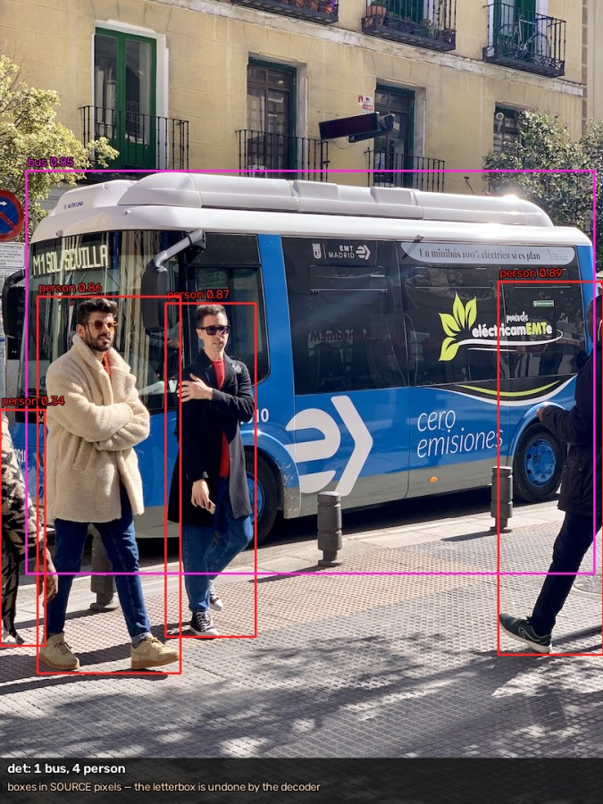 | 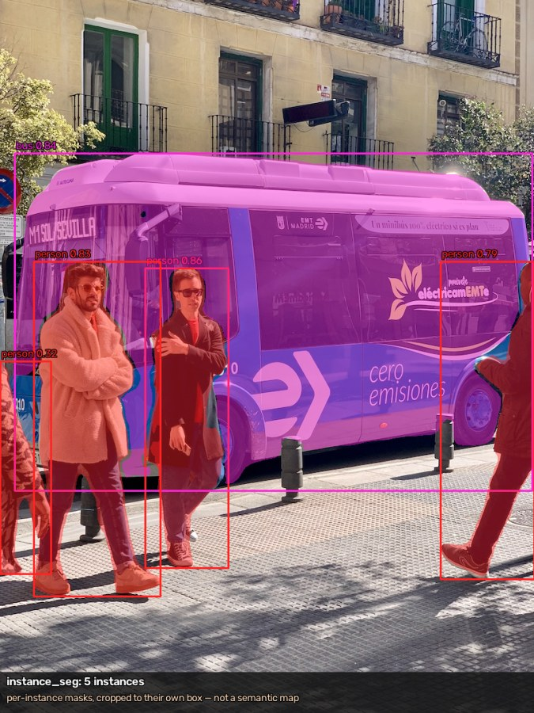 | 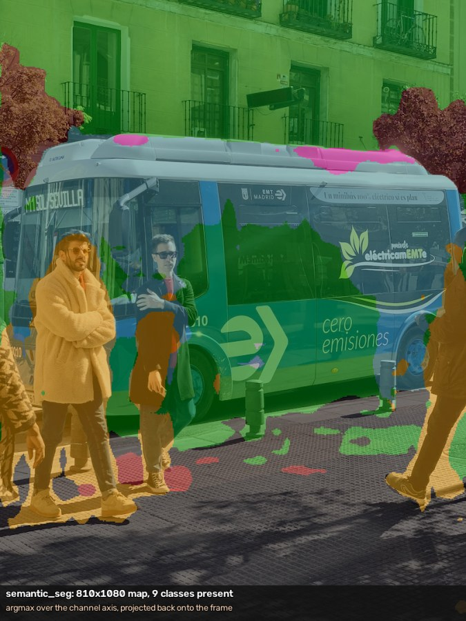 |
| 检测 | 实例分割 | 语义分割 |
| 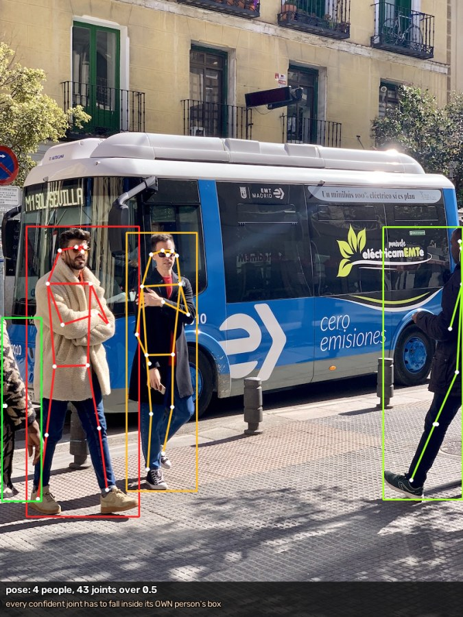 |  | 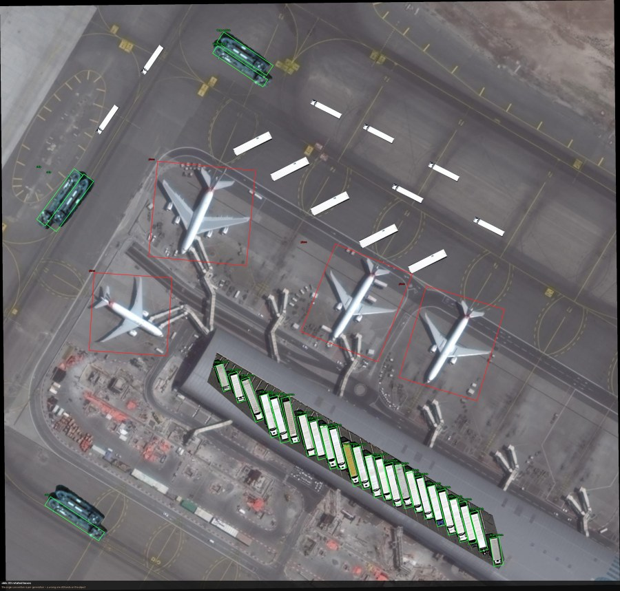 |
| 姿态（17 点） | 全身姿态（133 点） | 旋转框 |
| 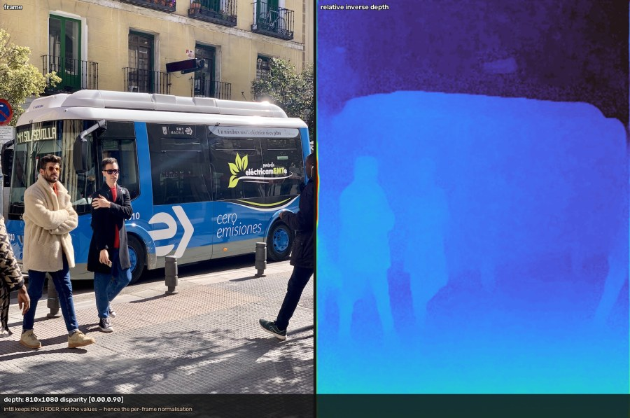 | 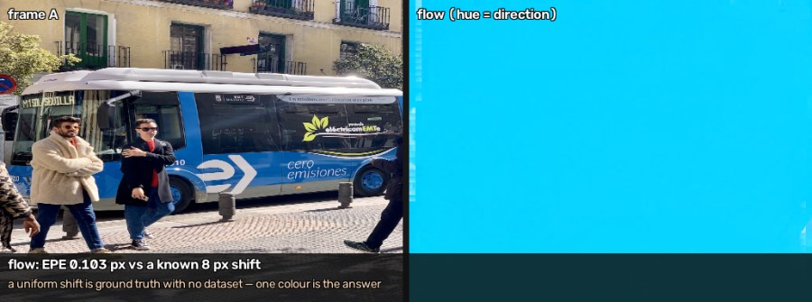 | 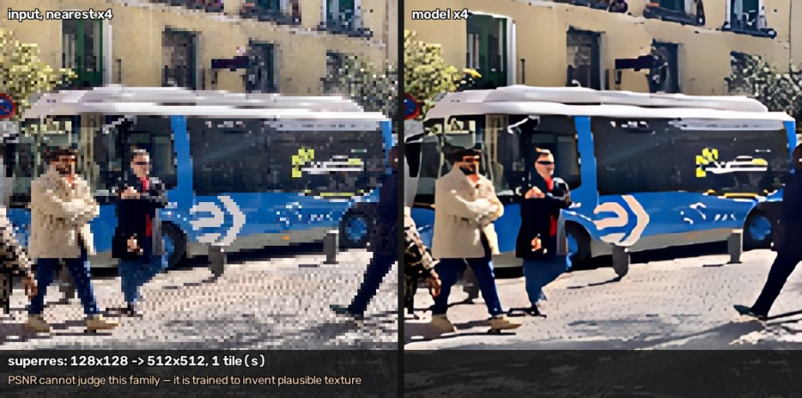 |
| 单目深度 | 稠密光流 | ×4 超分 |
| 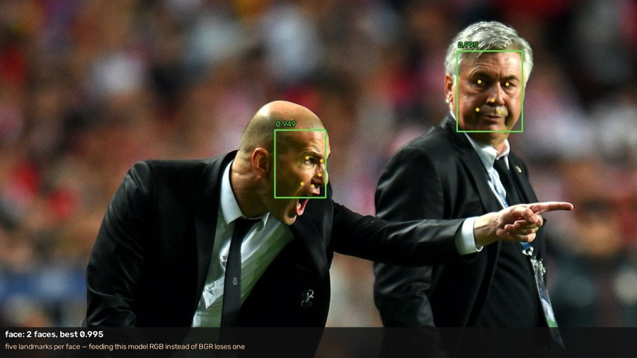 | 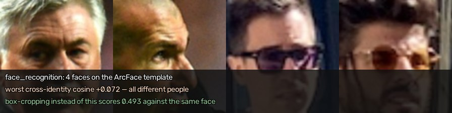 | 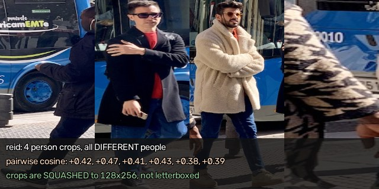 |
| 人脸 + 5 点 | 人脸识别（对齐后的 crop） | 行人 ReID |
| 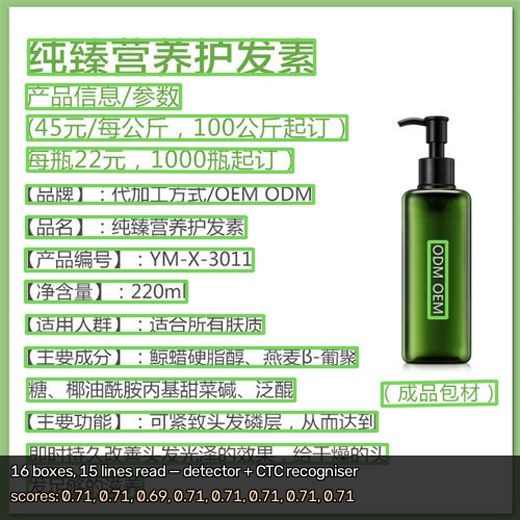 | 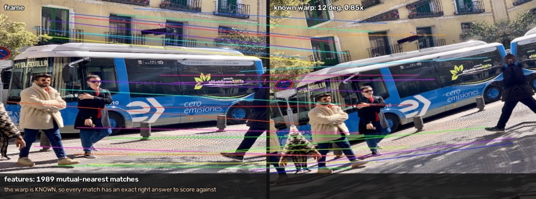 | 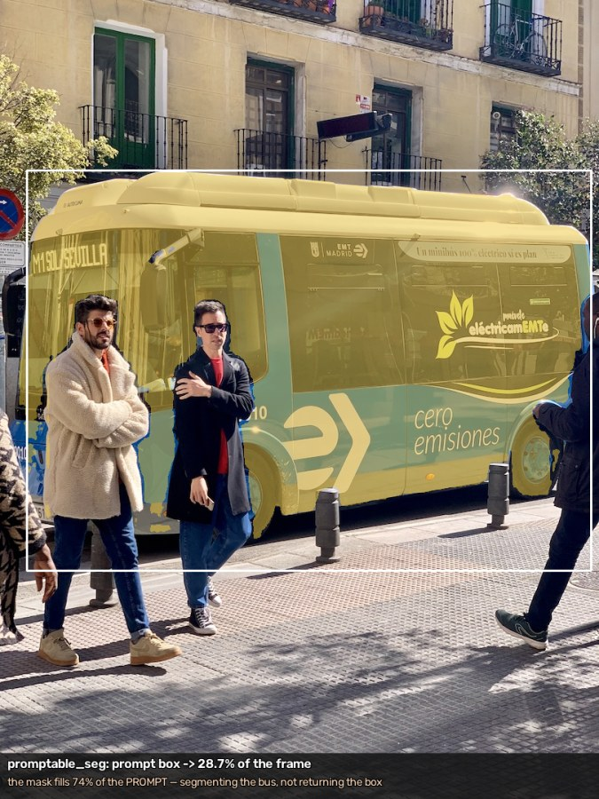 |
| OCR（检测 + 识别） | 稀疏特征 + 匹配 | 可提示分割 |
| 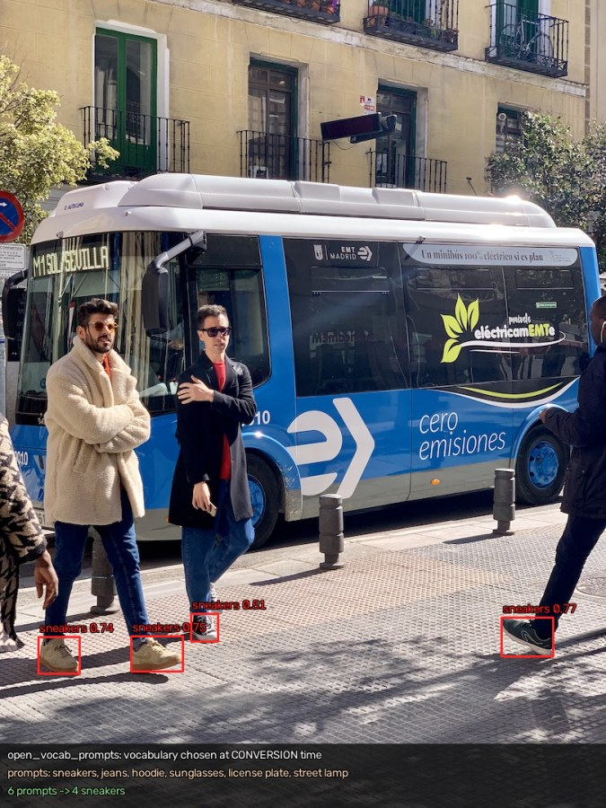 | 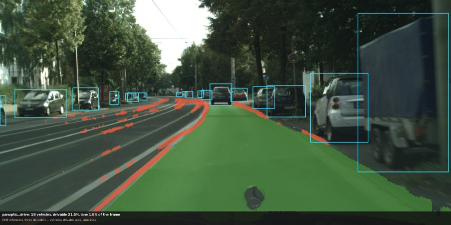 | 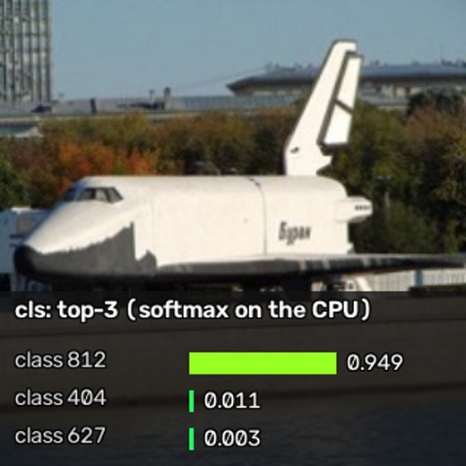 |
| 开放词表检测（`sneakers`） | 全景驾驶（一次推理，三个头） | 分类 |

有几张的重点是**对照**而不是画面本身：开放词表那张里的词表是转换期定的，`sneakers`
在 COCO 里根本没有这个类；人脸识别那张画的是**对齐后**的 crop，因为规范姿态才是模型契约
（拿检测框裁出来喂进去，对同一张脸只能拿到 0.493）；光流和特征那两张的形变是**已知的**，
所以每个匹配都有精确的正确答案可以打分。

```python
import rcdl, numpy as np

engine = rcdl.Engine("models/resnet18_rk3588.rknn")   # 零拷贝 I/O，输入 uint8 NHWC
out = engine.infer(np.zeros(engine.input_shape(0), dtype=np.uint8))[0]   # float32 已反量化
print(out.shape, engine.last_run_micros(), "us on the NPU")
```

```cpp
#include "rcdl/rcdl.h"
rcdl::Engine e("models/resnet18_rk3588.rknn", {rcdl::NpuCore::Core0});
auto e1 = e.dup(rcdl::NpuCore::Core1);   // 同一权重，第二个 NPU 核
e.setInput(0, img, e.inputPackedBytes(0));
e.infer();
std::vector<float> logits = e.outputAsFloat(0);
```

## 设计原则

- **模型在 NPU 上跑，预处理在 RGA 上做，编解码在 VPU 上做。** CPU 只做后处理
  （NMS / DFL / CTC …）和受保护的回退路径，不是默认路径。
- **dma-buf 是唯一的共享缓冲。** NPU（`rknn_create_mem_from_fd`）、RGA
  （`importbuffer_fd`）、VPU（MPP 外部 buffer）都按 fd 导入同一块内存，
  解码 → letterbox → 推理 → 编码全程不经过 `memcpy`。
- **多核是一等公民。** RK3588 的 3 个 NPU 核通过 `Engine::dup()` + 核掩码
  并发使用；小模型单核一个 context，大模型合并掩码。
- **后处理可移植、可验证。** 解码器是与 Engine 无关的纯函数，用确定性 numpy
  测试钉死；板端测试在真实 `.rknn` 上验证完整硬件路径。
- **写下来就是可公开的。** 仓库不含机器名、路径、私有笔记或本地工具配置；
  `scripts/check_publishable.sh` 在提交前扫描。

## 架构

```
                    你的应用（C++ / Python）
                              ↓
   ┌──────────────────────────────────────────────────────┐
   │  RCDL                                                 │
   │  tasks · tracks · pipeline · media · preproc · backend │
   └──────────────────────────────────────────────────────┘
                              ↓
        Rockchip 官方运行时（能力的来源）
        librknnrt (RKNPU2) · librga (im2d) · librockchip_mpp (rk_mpi)
                              ↓
              NPU ×3 · RGA3 ×2 + RGA2 · VPU（rkvdec / rkvenc / JPEG）
```

| 目录 | 内容 | 状态 |
|---|---|---|
| `core/` | `DmaBuf`（dma-heap RAII + cache sync）· `Status` | ✅ M0 |
| `backend/` | `Engine`（零拷贝 I/O · 反量化 · 核掩码 · dup）· 输出读取 | ✅ M0 |
| `preproc/` | RGA letterbox / resize / cvtColor + CPU 回退 | ✅ M1 |
| `media/` | MPP H.264 / H.265 / VP9 / AV1 / JPEG 编解码，外部 buffer group | ✅ M2 |
| `tasks/` | det · cls · pose · instance-seg · semseg · obb · depth · embedding · ocr · face · sparse features · 超分 · 光流 · 可提示分割 · 全身姿态 · 开放词表检测 · 全景驾驶 | ✅ M1 / M4 / M7–M10 |
| `tracks/` | ByteTrack + BoT-SORT 外观关联 · ReID | ✅ M3 |
| `pipeline/` | 同步 / 异步检测（EnginePool 多核） | ✅ M3 |
| `python/` | nanobind 绑定（推理时释放 GIL） | ✅ |

基准测试（板端实测，可重跑）：[`benchmarks/RESULTS.md`](benchmarks/RESULTS.md)。

## 快速上手

在板上（aarch64，已带 `librknnrt` / `librga` / `librockchip_mpp`）：

```bash
scripts/fetch_sdk.sh                 # RKNPU2 头文件（板子镜像不带）→ third_party/rknpu2
scripts/build.sh                     # cmake + ninja → build/
./build/model_info models/resnet18_rk3588.rknn        # I/O 签名、运行时/驱动版本、延迟
./build/npu_bench  models/resnet18_rk3588.rknn 5 0,1,2   # 三核并发吞吐
./build/dma_buf_probe                                   # dma-heap 是否对当前用户可用
./build/det_demo   models/yolov8n_rk3588.rknn data/images/bus.jpg out.jpg   # 检测 + 画框
./build/video_decode  clip.h264 --frames 300            # VPU 解码吞吐 + 零拷贝确认
./build/video_det_demo models/yolov8n_rk3588.rknn clip.h264 --out out.h264  # VPU→RGA→NPU→VPU
./build/async_bench models/yolov8n_rk3588.rknn data/images/bus.jpg          # 三核吞吐对比
PYTHONPATH=build:python python -m pytest tests/ --model models/resnet18_rk3588.rknn
```

从工作站迭代（编辑 → 同步 → 板上构建）：

```bash
cp scripts/local.env.example scripts/local.env   # 填 ssh 别名（gitignored）
scripts/bootstrap_board.sh    # 一次性：板上建 rcdl conda 环境（env/environment.yml）
scripts/sync.sh && scripts/board_build.sh --run   # MODEL=/path/on/board.rknn
```

## 运行环境要求

- 一块 **RK3588 / RK3588S**（RK3576 / RK356x 计划中）开发板，Linux（aarch64），
  板上有 RKNPU 驱动（`/dev/rknpu`，≥ 0.9.x）、`/usr/lib/librknnrt.so`（2.3.x）、
  `librga` 与 `librockchip_mpp` 的开发包（`/usr/include/rga`、`/usr/include/rockchip`）。
- dma-heap 对当前用户可读写（通常把用户加进 `video` 组即可）。
- CMake ≥ 3.18、GCC ≥ 11、Ninja；Python 模块需要 **nanobind** + NumPy。
- OpenCV 可选（`RCDL_HAVE_OPENCV` 守卫，有手写回退）。

## 模型

RCDL 只消费编译好的 `.rknn`。ONNX → `.rknn`（rknn-toolkit2 PTQ、精度分析、
混合量化）在 x86 主机上完成，由独立的模型仓负责；`scripts/fetch_models.sh`
负责把模型放进 `models/`。见 [`models/README.md`](models/README.md)。

## 文档

| 文档 | 内容 |
|---|---|
| [`docs/ROADMAP.md`](docs/ROADMAP.md) | 架构映射（BCDL → RCDL）、里程碑、RK3588 硬件要点 |
| [`docs/API.md`](docs/API.md) | Python API |
| [`docs/CPP_API.md`](docs/CPP_API.md) | C++ API |
| [`docs/RGA.md`](docs/RGA.md) | RGA 能做什么、不能做什么（含三条文档没写、实测才发现的限制） |
| [`docs/MODELS.md`](docs/MODELS.md) | 模型登记表、每个模型的输入通道序与激活位置、实测性能 |
| [`CONTRIBUTING.md`](CONTRIBUTING.md) | 如何搭建、构建（在板上）、测试并提交改动 |
| [`CHANGELOG.md`](CHANGELOG.md) | 发布说明（Keep a Changelog / SemVer） |

## 致谢

- **Rockchip** —— RK3588 平台、RKNPU2 运行时与 rknn-toolkit2、RGA、MPP。
- **BCDL / ccdl** —— 本项目的上层 API 设计与后处理算法来源。

## 许可证

[Apache License 2.0](LICENSE)。Rockchip 的运行时库与头文件遵循其各自的许可证，
本仓库不再分发它们（`scripts/fetch_sdk.sh` 从公开仓库获取）。
